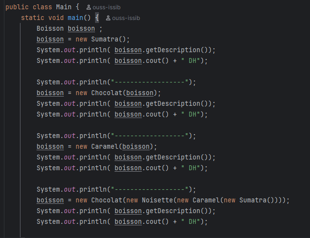
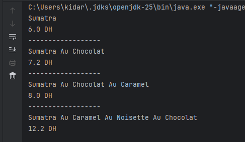

# ☕ Activité Pratique - Implémentation du Design Pattern **Decorator** en Java

Ce dépôt contient une implémentation pratique du **Design Pattern Decorator** en Java.  
Cette activité fait partie du cours de **Design Patterns** encadré par **Mr YOUSSFI Mohamed**.

---

## 📘 Aperçu du projet

### Design Pattern Decorator

- **Objectif** : Illustrer la mise en œuvre du **Design Pattern Decorator** en Java, qui permet d’ajouter dynamiquement de nouvelles fonctionnalités à un objet sans modifier son code d’origine.  
  Ce pattern favorise la **flexibilité**, la **réutilisation du code** et respecte le **principe Ouvert/Fermé** (Open/Closed Principle).

- **Technologies utilisées** :
  - `Java` pour la conception orientée objet.
  - Aucun framework requis (fonctionne avec tout IDE Java).

---

## 🧱 Structure du projet

### Packages principaux

#### 📦 `composants`
Contient les classes de base représentant les **boissons** (composants concrets) :
- **Boisson** : classe abstraite de base contenant la méthode `cout()` et la description.
- **Deca**, **Espresso**, **Sumatra** : implémentations concrètes de boissons avec leurs coûts respectifs.

#### 📦 `decorator`
Contient les **décorateurs** ajoutant dynamiquement des fonctionnalités :
- **Decorator** : classe abstraite héritant de `Boisson` et contenant une référence vers une autre `Boisson`.
- **Chocolat**, **Caramel**, **Noisette** : décorateurs concrets ajoutant respectivement un coût supplémentaire pour chaque ingrédient.

---

## ⚙️ Fonctionnalités principales

1. Création d’une hiérarchie de **boissons** et de **décorateurs** indépendants.  
2. Possibilité d’ajouter plusieurs décorateurs à une boisson de base (composition dynamique).  
3. Calcul du coût total et affichage de la description complète de la boisson finale.  
4. Illustration du principe **Open/Closed** : extension sans modification du code existant.

---

## 🧩 Schéma de fonctionnement

| Code du Decorator | Résultat d’exécution |
|---|---|
|  |  |
| Exemple d’implémentation avec plusieurs décorateurs (Chocolat, Caramel, Noisette). | Résultat console affichant la description complète et le prix total de la boisson décorée. |

---

## 🚀 Comment Exécuter

1. **Cloner le dépôt :**
   ```bash
   git clone https://github.com/ouss-issib/design-pattern-decorator-java.git
   ```
2. Naviguer dans le répertoire du dépôt :
```bash
   cd design-pattern-decorator-java
```  
3. Compiler et exécuter les fichiers Java :
```bash
 mvn clean install mvn javafx:run
